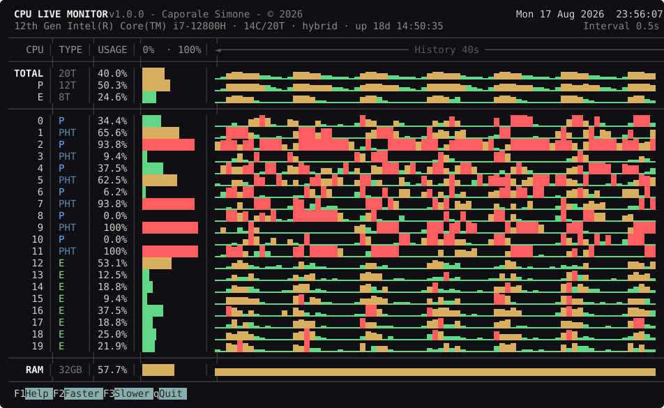

# cpumon

A terminal CPU live monitor: per-logical-processor history, hybrid (P/E core)
awareness and a fully responsive layout. Standard library only, on Windows and
Linux.



## Requirements

- Python `>=3.12,<3.13` — to *run*, that is all. The app has no dependencies.
- [Poetry](https://python-poetry.org/) `>=2.0` — to *develop*. The manifest uses
  PEP 621 `[project]` and PEP 735 `[dependency-groups]`, neither of which Poetry
  1.x can read; it fails with "The fields [...] are required in package mode".

## Setup

```bash
poetry install
```

## Usage

```bash
poetry run cpumon                      # start the monitor
poetry run cpumon -i 0.5               # initial sampling interval, in seconds
poetry run cpumon --selftest 120 40    # render one frame at that size and exit
poetry run cpumon --probe              # print backend diagnostics and exit
poetry run cpumon --help
python -m cpumon
```

Keys: `F1` help (`Up`/`Down`, `PgUp`/`PgDn` scroll it, `Esc` or `q` closes it),
`F2` faster sampling, `F3` slower sampling, `q` or `Ctrl-C` to quit.

Shrinking the window folds SMT siblings, then groups cores, then collapses to
per-class rows, then to totals alone. Narrowing drops the history column, then
the gauge, then the type column.

## Deploying to a device without poetry or pip

The app is pure standard library, so a device needs nothing but a CPython
interpreter. Build a single self-contained archive:

```bash
python tools/build_zipapp.py          # -> dist/cpumon.pyz (~65 KiB)
```

Copy that one file over and run it:

```bash
python cpumon.pyz                     # Windows and Linux
./cpumon.pyz                          # Linux, after chmod +x (uses the shebang)
```

No install, no unpacking, no site-packages, no `PYTHONPATH`. All the CLI flags
work as usual (`--selftest`, `--probe`, `--version`).

Two things the build script does deliberately:

- It reads `[project].version` from pyproject.toml **at build time** and writes
  it into the archive as `cpumon/_version.py`. An archive carries no
  distribution metadata, and the app never reads pyproject.toml at runtime, so
  this is what keeps `--version` and the title bar honest. Rebuild after a
  version bump.
- It writes its own `__main__.py` instead of letting `zipapp` generate one:
  the generated entry point discards the return value of `main()`, which would
  flatten every exit code to 0.

### Linux and WSL

Nothing here needs Poetry — the app has no dependencies, and the build script
uses only the standard library:

```bash
python3 dist/cpumon.pyz            # run the archive
python3 tools/build_zipapp.py      # or build it, from Linux too
chmod +x cpumon.pyz && ./cpumon.pyz
PYTHONPATH=src python3 -m cpumon   # run straight from the sources
```

Three things to know when the same working copy is shared with Windows:

- **`poetry install` needs Poetry ≥2.0** (see Requirements). Upgrading is the fix;
  adding the legacy `[tool.poetry]` fields would mean maintaining two manifests
  and two version numbers, which is exactly the drift the single source of truth
  is there to prevent.
- **Do not share the in-project virtualenv.** `poetry.toml` sets
  `virtualenvs.in-project = true`, so a `.venv/` created on Windows (with
  `Scripts/`, and `pyvenv.cfg` pointing at `C:\...`) is unusable from Linux and
  vice versa. Use `POETRY_VIRTUALENVS_IN_PROJECT=false poetry install` on the
  second platform, or keep a separate clone.
- **`PYTHONPATH=src python3 -m cpumon` reports version `0.0.0`.** That is the
  documented fallback: an uninstalled source tree carries no distribution
  metadata, and the app never reads pyproject.toml at runtime. Install it, or run
  the archive, to see the real version.

The target interpreter is **Python 3.12**: that is `requires-python` in
pyproject.toml, and `cpumon/cli/python_check.py` enforces the same window at
startup, before any other project import, so an unsupported interpreter fails
with one clear line instead of a traceback. The two copies of the range are kept
in step by `tests/test_python_check.py`.

## Architecture

The package is layered so that each layer knows only the one below it, and the
dependency rules are enforced by `tests/test_architecture.py` rather than merely
documented.

📄 **[docs/architecture.md](docs/architecture.md)** — the layering, the three
seams that keep collection, rendering and key handling independent, and an audit
of every abstraction, including how to add a platform or a second renderer.

📄 **[docs/history.md](docs/history.md)** — how many samples are retained, what
they cost in memory, and the rules the history store follows.

## Development

Quality gates:

```bash
poetry run ruff check .
poetry run ruff format --check .
poetry run mypy src/ tools/
poetry run pytest
```

`tools\deploy.bat` runs all four and only then builds the archive, so
`dist/cpumon.pyz` is never a build of broken code.

Other tools:

```bash
python tools/measure_cpu.py --match cpumon.pyz --threads   # what it costs, from /proc
python tools/make_screenshot.py                            # regenerate the image above
```

## Notes

The legacy single-file implementation is preserved on the `singlefile` branch.
The package produces byte-for-byte identical frames, bar the quit key and the
version string.
